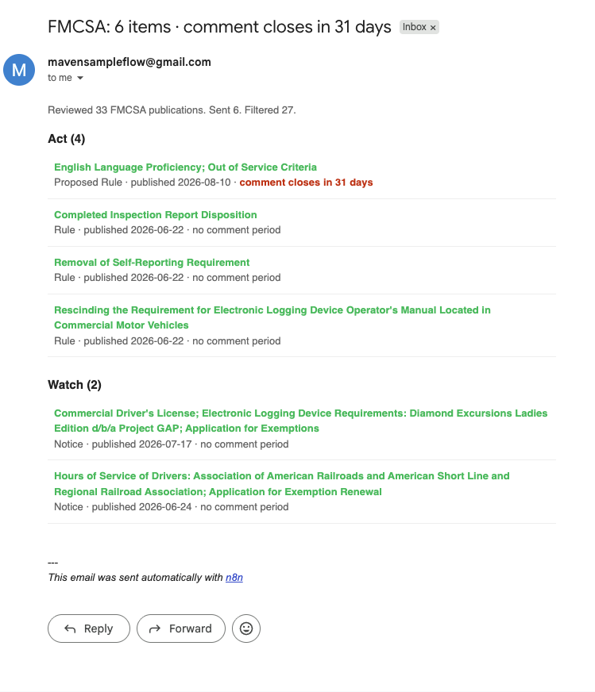
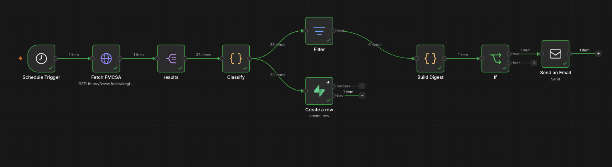

# Sierra Line Haul — daily FMCSA regulatory monitor

**Trucking · Detect · Federal Register API**

> Of 33 FMCSA publications reviewed, 27 were irrelevant to a 42-truck carrier.
> The 6 that were not included a proposed rule with a comment window closing in 31 days.



---

## The client

Sierra Line Haul runs 42 power units out of Fontana, California — regional dry
van, mostly port drayage and Inland Empire to Phoenix lanes. DOT compliance is
one person, and that person also handles safety and HR.

That headcount is the constraint the whole build turns on. A carrier this size
has no compliance department, no outside counsel on retainer, and no budget to
read the Federal Register.

## What they asked for

> "We found out about a rule change from a customer. Our association sends a
> newsletter but it's monthly, and by then the comment period's closed."

## What they actually needed

This reads like an information problem and it isn't. The information is
public, free, and published the day it happens — the carrier is simply
receiving it late, through a channel with a monthly cycle, filtered by someone
whose priorities are not theirs.

The cost of the delay is specific. Comment periods are the only window in which
a carrier has any influence over a rule at all, and they are typically 30 to 60
days. A monthly newsletter can consume the entire window before the reader ever
sees the item. By the time it arrives it is no longer actionable information;
it is news.

So the deliverable is not a summary service. It is a latency fix with a filter
attached — and the filter matters as much as the speed, because a compliance
manager who receives all 33 documents a day has been handed the same problem in
a new envelope.

---

## What it does

Every morning the system pulls the previous day's Federal Register
publications for FMCSA, classifies each one against what a small carrier
actually has to act on, and emails only what survives. Items that require
action lead the email; items worth watching sit below them. Anything with a
comment deadline carries a countdown, and the nearest deadline is promoted into
the subject line so it is visible without opening the message.

Every document seen is stored, so a document already reported never appears
twice. On days when nothing relevant publishes, nothing is sent.

**Input:** Federal Register API, FMCSA agency documents
**Output:** one HTML email, act and watch sections, every item linked to source
**Runs:** daily at 6:00am, unattended

## The rules it applies

| Rule | Threshold | Why |
|---|---|---|
| Document type | Rule or Proposed Rule → eligible for **act** | Notices rarely change what a carrier must do |
| Keyword match | Title or abstract contains a carrier-relevant term | Hours of service, ELD, CDL, drug and alcohol, driver qualification, brakes, inspection, insurance, hazmat |
| Ignore list | Explicit phrase match → discarded regardless of type | Individual driver exemption applications, advisory committee notices, out-of-state transportation projects, Sunshine Act meetings, information collection requests |
| Deadline | Comment date already passed → discarded | A closed comment period is not actionable |
| Everything else | → **watch** | Relevant but not requiring a response |
| Dedupe | Document number is the primary key | A re-published document is not a new one |

The ignore list is doing more work than the keyword list. Most FMCSA output is
procedural, and procedural filings are the ones that make a compliance manager
stop trusting an alert.

---

## What it found

Run of 8 September 2026, 90-day lookback:

1. **33 documents reviewed, 6 delivered, 27 filtered.** The filtered set was
   dominated by individual driver medical exemption applications — publicly
   filed, individually named, irrelevant to any carrier that does not employ
   that driver.

2. **The lead item was a proposed rule on English language proficiency and
   out-of-service criteria, with 31 days remaining to comment.** This is the
   class of item the newsletter cycle loses: published, consequential, and on
   a clock.

3. **Three of the four act-bucket items were deregulatory** — rescinding the
   ELD operator's manual requirement, removing a self-reporting requirement,
   and changing inspection report disposition. Worth naming because the
   assumption behind a compliance alert is usually that new obligations are
   arriving. Half the value here was telling a carrier it could stop doing
   something.

4. **Zero false positives in the delivered set.** Every one of the six was
   genuinely carrier-relevant on manual review. The keyword list was not tuned
   after the first run.

## How to read the email


The line that matters is the count at the top: reviewed, sent, filtered. Every
alert product can tell you what it found. Very few will tell you how much it
threw away, and that number is the only evidence the filter is doing anything.
Without it, "6 items today" is indistinguishable from a source that only
publishes 6 items.

---

## How it's built



- **Source:** Federal Register public API. No key, no registration. Single
  request per run, well inside any rate limit.
- **Store:** Supabase Postgres, one row per document, `document_number` as
  primary key.
- **Logic:** one classification pass — type gate, keyword match, ignore-phrase
  match, deadline arithmetic — assigning act, watch, or ignore.
- **Surface:** HTML email over SMTP.

**Handled failure modes:**

- **Duplicate document** — the insert violates the primary key and the node is
  configured to continue on error. The document is already known; nothing is
  re-sent. This is the dedupe mechanism, not an error path bolted on afterward.
- **Nothing relevant published** — the Federal Register does not publish on
  weekends, so roughly two days a week produce an empty result. The send is
  gated on a non-zero count and the run ends silently. An alert system that
  emails "no updates today" trains its reader to stop opening it.
- **Storage unavailable** — the database write is on a branch of its own. If
  Supabase is down the digest still sends; only deduplication degrades.
- **Ambiguous item** — anything that fails the keyword gate but is a Rule or
  Proposed Rule lands in watch rather than being discarded. The system prefers
  a false watch to a false ignore.

## Known limitations

- **Final rules carry effective dates, not comment deadlines.** Four of the six
  items in the sample run have a null countdown for this reason. The fix is to
  pull `effective_on` from the API and fall back to it — not done here, and
  named rather than hidden.
- **The keyword list is a guess.** For a real carrier it would be derived from
  their own violation and audit history, which is exactly the input a fictional
  client cannot supply.
- **Federal only.** California carriers also answer to CARB and the CHP, and
  neither publishes to the Federal Register.

## Running it yourself

```
# import workflow/sierra-regulatory-monitor.json into n8n
# create the table
psql < queries/schema.sql
```

Required environment: a Supabase project URL and service key, and SMTP
credentials. Names only — no values are committed.

---

## Notes

- Sierra Line Haul is fictional. The Federal Register data is real and public.
- Sample run: 90-day lookback, 8 September 2026, 33 documents.
- Production schedule is a 1-day lookback; the 90-day window was used to
  produce a demonstrable sample from a single run.
- With more time: `effective_on` fallback, and a second source for state-level
  rulemaking.
